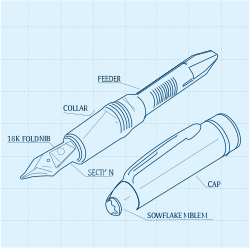
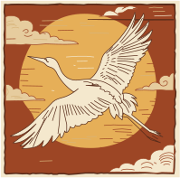

# quiver-mcp

[](https://www.npmjs.com/package/@syntropic/quiver-mcp)
[](https://www.npmjs.com/package/@syntropic/quiver-mcp)
[](LICENSE)

MCP server for [QuiverAI](https://quiverai.com) — generate SVGs from text prompts and vectorize raster images using AI, directly from Claude (or any MCP-compatible client).

## Examples

Generated by Claude calling this MCP. Each took ~60s at `n: 3, temperature: 0.9`. Both prompts are documented in the tool description, so Claude knows the recipe.

<table>
<tr>
<td width="50%" align="center">

</td>
<td width="50%" align="center">

</td>
</tr>
<tr>
<td valign="top">

**Prompt:** _exploded isometric view of a Montblanc Meisterstück fountain pen, technical blueprint drawing, thin line art, dotted grid background, labeled components, engineering illustration_

</td>
<td valign="top">

**Prompt:** _Japanese crane in traditional woodblock illustration style with warm earth tones_  
**Instructions:** _Use a warm muted palette with detailed feather work_

</td>
</tr>
</table>

More variants in [`examples/`](examples/).

## Requirements

- Node.js 18+
- A [QuiverAI](https://quiverai.com) API key

## Installation

### Claude Desktop

Add to your `claude_desktop_config.json`:

```json
{
  "mcpServers": {
    "quiverai": {
      "command": "npx",
      "args": ["-y", "@syntropic/quiver-mcp"],
      "env": {
        "QUIVERAI_API_KEY": "your_api_key_here"
      }
    }
  }
}
```

### Manual

```bash
npm install -g @syntropic/quiver-mcp
QUIVERAI_API_KEY=your_api_key_here quiver-mcp
```

## Tools

### `generate_svg`

Generate one or more SVGs from a text prompt.

| Parameter | Type | Required | Description |
|---|---|---|---|
| `prompt` | string | yes | Text description of the SVG to generate |
| `model` | string | yes | Model ID (use `list_models` to discover options) |
| `instructions` | string | no | Additional style or formatting guidance |
| `n` | number | no | Number of SVGs to generate (default: 1) |
| `temperature` | number | no | Sampling temperature 0–2 (default: 1) |
| `references` | array | no | Up to 4 image references (`{url}` or `{base64}`) for palette and composition guidance. Style keywords must still be in the prompt text. |
| `outputPath` | string | no | Absolute file path to save SVG(s) to disk. For multiple variants (`n > 1`), files are saved with `_1`, `_2` … suffixes. Parent directories are created automatically. |

#### Prompt tips

The tool description includes extensive prompt guidance, but in short:

- Structure prompts with three parts: **subject** (concrete object), **style** (aesthetic keywords like `line art`, `isometric`, `flat monochrome`), and **color palette** (hex codes where possible).
- Use famous physical objects the model knows. Avoid abstract software concepts (`AI agent`, `workflow`) — use physical metaphors instead.
- For exploration, generate 3+ variants at `temperature: 0.9`. Some generations produce corrupted tails; extra variants give you options.

### `vectorize_svg`

Convert a raster image (PNG, JPG, etc.) to SVG.

| Parameter | Type | Required | Description |
|---|---|---|---|
| `model` | string | yes | Model ID |
| `image` | object | yes | Image to vectorize — `{url}` or `{base64}` |
| `autoCrop` | boolean | no | Crop to dominant subject before vectorizing (default: false) |
| `targetSize` | number | no | Square resize target in pixels before vectorizing |
| `temperature` | number | no | Sampling temperature 0–2 (default: 1) |
| `outputPath` | string | no | Absolute file path to save the SVG to disk. Parent directories are created automatically. |

### `list_models`

List all available QuiverAI models with supported operations and pricing.

## Environment Variables

| Variable | Description |
|---|---|
| `QUIVERAI_API_KEY` | **Required.** Your QuiverAI API key |

## Development

```bash
npm install
npm run build   # compile TypeScript
npm run dev     # watch mode
```

## License

MIT
